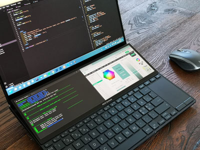

# Git repo for the MVC course
This is a Git repository for the course MVC at Blekinge Tekniska Högskola, BTH.

## Clone repo
In your terminal move to the location where you want the repository installed.

Run:

```
git clone https://github.com/foppa23/mvc
```

## Run website on local machine
In your terminal run:

```
php -S localhost:8888 -t public
```

In your browser go to:

```
http://localhost:8888/
```
